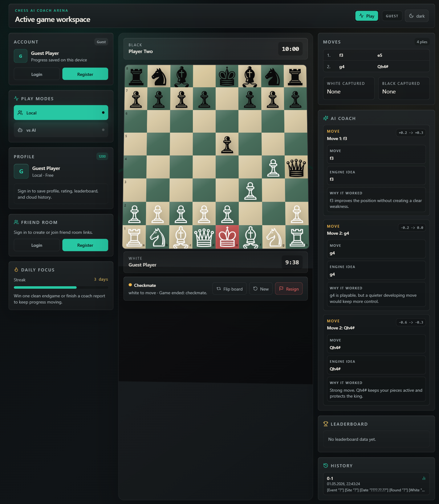
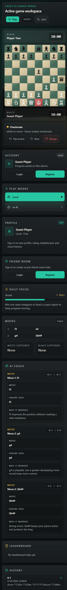

# Mahiru Arena

Mahiru Arena is a chess training workspace built around a short product loop: play a legal game, review engine-backed coach cards, replay the mistake position, and compare progress against other players locally or by city.

## Who It Is For

- Beginners who need plain-language feedback after a game.
- Casual and intermediate players who want fast local, AI, or friend-link games.
- Students and club players who care about rating, history, city competition, and repeatable practice.
- Reviewers who need to see a product-shaped chess prototype, not only a board demo.

## Why It Stands Out

- The AI Coach is structured for learning: each card separates the played move, the better engine idea, and the reason it mattered.
- Mistakes and blunders can be replayed immediately with `Practice this position`, turning post-game review into an active drill.
- The leaderboard can switch between global ranking and the signed-in player's city, including a city rank badge such as `#2 in Jerusalem`.
- Account-only Friends and Pro surfaces are gated behind real authenticated sessions, while guests can still play local and AI games.
- The app presents a polished arena workspace with responsive board play, live clocks, history, theme controls, and a 3D background.

## Product Loop

1. Choose `Local`, `vs AI`, or an account-backed friend room.
2. Play a legal chess game with clocks, move list, captured pieces, and board orientation controls.
3. Finish the game and review AI Coach cards with eval swing, better move, and explanation.
4. Practice from a mistake position, then reveal the engine hint after trying.
5. Check profile, history, and global or city leaderboard progress.

## Key Features

- Legal chess rules powered by `chess.js`.
- Click-to-move and drag-and-drop movement with promotion handling.
- Local two-player mode and Stockfish-backed AI mode with selectable difficulty.
- Friend-link multiplayer with account gating, room setup, WebSocket sync, reconnect restore, side selection, clocks, and resignation.
- Post-game AI Coach with engine-backed insights and readable fallback cards.
- Practice mode from mistake/blunder coach cards without a database migration.
- Global/city leaderboard filter with city names and current-user city rank badge.
- Account profile editing, saved history, and cloud-backed data when Supabase is configured.
- Guest-safe local history and account-only Friends/Pro navigation.
- Pro upgrade modal for the monetization path prototype.
- Light/dark themes and responsive desktop/mobile layout.
- Three.js arena scene behind the playable board.

## Screenshots





## Tech Stack

- Next.js, React, TypeScript
- Tailwind CSS
- Three.js for the arena scene
- `chess.js` for legal move generation
- Stockfish 18 lite WASM worker for AI play and coach analysis
- WebSocket room server for friend-link multiplayer
- Supabase-ready auth, profiles, rooms, history, friends, and coach storage
- Vitest, Testing Library, and Playwright

## Setup

```bash
npm install
npm run dev
```

Open:

```bash
http://localhost:3000
```

## Environment Variables

The production service adapter expects Supabase credentials:

```bash
NEXT_PUBLIC_SUPABASE_URL=your-project-url
NEXT_PUBLIC_SUPABASE_ANON_KEY=your-anon-key
```

Apply the SQL migrations in `supabase/migrations/` for Supabase-backed auth, profiles, games, rooms, friends, and coach data.

## Verification

```bash
npm test
npm run lint -- --quiet
npm run build
npm run test:e2e
```

## Current Limitations

- Stripe checkout is not implemented; monetization is represented by the Pro modal and gated UI path.
- Supabase live mode requires a configured project, migrations, auth settings, and Realtime for the `rooms` table.
- Practice FEN is runtime-only for v1; no new coach insight migration is required.
- The leaderboard is profile/rating based and is not a full ranked matchmaking system.
